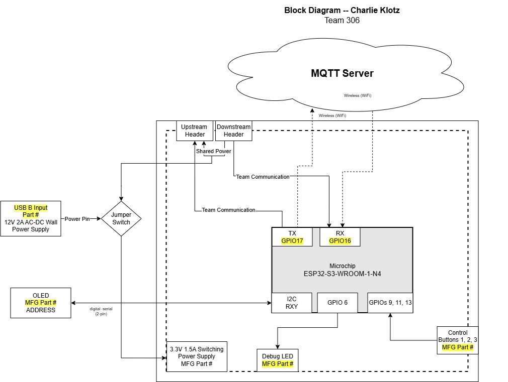

## Overview
This block diagram shows how the subsystem will interact with the rover wirelessly. It should allow the operator to give commands to the rover through the use of a display and buttons. This is a final draft of how the subsystem was designed to work along side the other components of the system. 

## Block Diagram 

## Decision Making Process
This subsystem was designed to act as a human interface for our rover. To do that, it was designed as a hub for communication through the header pins. Information is received through the header pins, and is processed by the ESP32 microcontroller. Data strings are then passed through if needed, but are also always displayed on the OLED screen for debugging. 

It has 4 build in debugging LEDs, intended to confirm connections for each subsystem. It also has 3 buttons on GPIO pins for inputs, meant to control the menu coded into the OLED screen, controlling what messages and commands are sent throughout the system.

With all these functions, the subsystem acts as a central hub for communication and control, allowing the other subsystems to work with it easily.