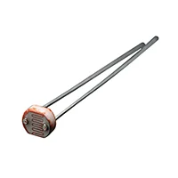
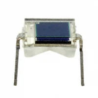
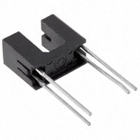

*Table 1: Light Sensor Selection*

**Light Sensor Module**

| **Solution**                                                                                                                                                                                      | **Pros**                                                                                                                                    | **Cons**                                                                                            |
| ------------------------------------------------------------------------------------------------------------------------------------------------------------------------------------------------- | ------------------------------------------------------------------------------------------------------------------------------------------- | --------------------------------------------------------------------------------------------------- |
|  Option 1.  1528-161-ND Photoresistor $0.95/each [link to product](https://www.digikey.com/en/products/detail/adafruit-industries-llc/161/7244927)                 | \* Inexpensive \* Simple                                                | \* Slow Response \* Output is nonlinear |
|  \* Option 2.  \* 475-BPW34-ND Photodiode  \* $1.14/each  \* [Link to product](https://www.digikey.com/en/products/detail/ams-osram-usa-inc/BPW34/607274) | \* Fast Output  \* Linear Output   \* Low Cost | * Slight temperature drift  \* Slow shipping speed                                                         |
|  \* Option 3.  \* 365-1918-ND Phototransistor  \* $1.76/each  \* [Link to product](https://www.digikey.com/en/products/detail/tt-electronics-optek-technology/OPB200/1636789) | \* Simple interface  \* High default output gain   | * More expensive  \* Slow response time                                                         |

**Choice:** Option 2: 475-BPW34-ND Photodiode

**Rationale:** A photodiode is preferred because it provides a linear and accurate response to light. It will require an external amplifier circuit, but its predictable behavior will make it more reliable than other options for our use case. 