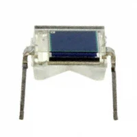

*Table 1: Light Sensor Selection*

**Light Sensor Module**

| **Solution**                                                                                                                                                                                      | **Pros**                                                                                                                                    | **Cons**                                                                                            |
| ------------------------------------------------------------------------------------------------------------------------------------------------------------------------------------------------- | ------------------------------------------------------------------------------------------------------------------------------------------- | --------------------------------------------------------------------------------------------------- |
|  Option 1.  1528-161-ND Photoresistor $0.95/each [link to product](https://www.digikey.com/en/products/detail/adafruit-industries-llc/161/7244927)                 | \* Inexpensive \* Simple                                                | \* Slow Response \* Output is nonlinear |
|  \* Option 2.  \* 475-BPW34-ND Photodiode  \* $1.14/each  \* [Link to product](https://www.digikey.com/en/products/detail/ams-osram-usa-inc/BPW34/607274) | \* Fast Output  \* Linear Output   \* Low Cost | * Slight temperature drift  \* Slow shipping speed                                                         |
|  \* Option 3.  \* 365-1918-ND Phototransistor  \* $1.76/each  \* [Link to product](https://www.digikey.com/en/products/detail/tt-electronics-optek-technology/OPB200/1636789) | \* Simple interface  \* High default output gain   | * More expensive  \* Slow response time                                                         |

**Choice:** Option 2: 475-BPW34-ND Photodiode

**Decision Making Process:** A photodiode is preferred because it provides a linear and accurate response to light. It will require an external amplifier circuit, but its predictable behavior will make it more reliable than other options for our use case. This sensor will make it easy to take ambient light readings of the room to be pushed out to the individual lighting subsystem, to help fulfill our project needs.

**Other Components:** The rest of the components used will be the ones provided already in class, such as the LM7805 Voltage Regulator or MCP6004 OP-Amp.