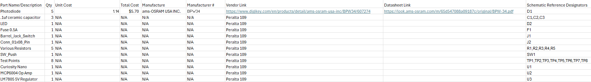

## Overview
This bill of materials acts as a visual guide to the parts being used in the light sensor subsystem. It shows all parts needed to be ordered aswell as the parts that were given inside of class. 

## Bill of Materials

{style width: "2000"}

**Figure 1:** Bill of Materials as a screenshot.