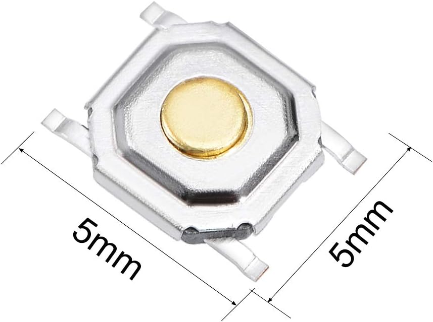
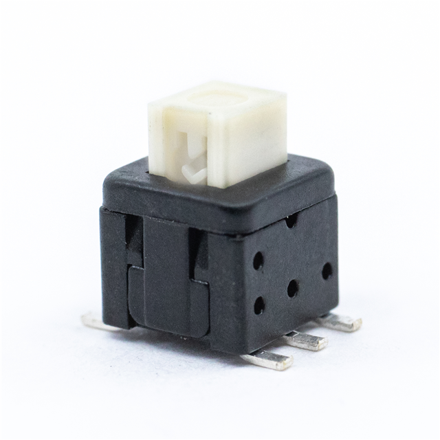
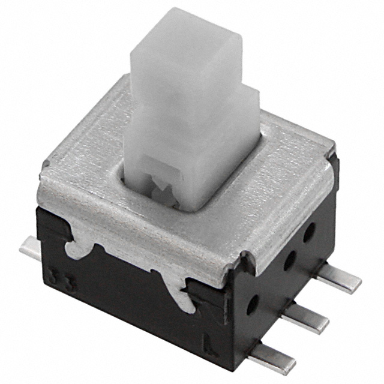

## Module's Selected Major Components

The following sections are the selected major components necessary for the human interfacing function for our team's rover. 

### Power Management

* LM2575 - 3.3 volt switching regulator provided in class

[link to product](https://www.digikey.com/en/products/detail/evvo/LM2575S-3-3-EV/24370070)

### No Sensor
### No Actuator
### Microcontroller
ESP32 Was chosen over the PIC due to its wifi functionality (Human Machine Interface needs to interface with WIFI components).
### Screen
OLED Provided in class is perfect for the final project as an SMD part is not required for the screen.

[link to similar product](https://www.digikey.com/en/products/detail/winstar-display/WEA012864DWPP3N00003/20533255)

With all that, the only thing needed to be chosen for my subsystem ended up being the buttons (Other than capacitors and diodes, which I pretty much picked the first smallish SMD part I saw on Amazon since I forgot them in my original purchase sheet.)

-----------
## Buttons
*Table 1: Button component selection*

| **Component**                                                                                                                                                                                      | **Pros**                                                                                                                                    | **Cons**                                                                                            |
| ------------------------------------------------------------------------------------------------------------------------------------------------------------------------------------------------- | ------------------------------------------------------------------------------------------------------------------------------------------- | --------------------------------------------------------------------------------------------------- |
|   Small push button from amazon $0.22/each [link to product](https://www.amazon.com/dp/B07HCF49KC?ref=ppx_yo2ov_dt_b_fed_asin_title)                 | \* Cheap \* Good Form Factor \* Nice Looking                                               | \* Tiny Contact Area \* Poor Tactile Feedback | ------------------------------------------------------------------------------------------------------------------------------------------------------------------------------------------------- | ------------------------------------------------------------------------------------------------------------------------------------------- | --------------------------------------------------------------------------------------------------- |
|   Small push button from digikey $0.44/each [link to product](https://www.digikey.com/en/products/detail/e-switch/TL2233OA/15220943)                 | \* 6 Pin Switch \* Larger Button Area \* Decent Size                                               | \* A little more expensive \* A little ugly | ------------------------------------------------------------------------------------------------------------------------------------------------------------------------------------------------- | ------------------------------------------------------------------------------------------------------------------------------------------- | --------------------------------------------------------------------------------------------------- |
|   Another small push button from digikey $1.96/each [link to product](https://www.digikey.com/en/products/detail/panasonic-industry/ESB-33535A/3873298)                 | \* 6 Pin Switch \* Decent Button Area \* Meets surface mount constraint of project                                               | \* Really Expensive \* Pretty Ugly |

### Final Choice: Option 1

## Decision Making Process
 Button option 1 is a decently sized button that looks decent while also being the most inexpensive option. It is a clear choice for the subsystem.

# Final Major Components:
* Voltage Regulator: LM2575
* Microcontroller: ESP32
* Screen: Adafruit 1.3" OLED Display