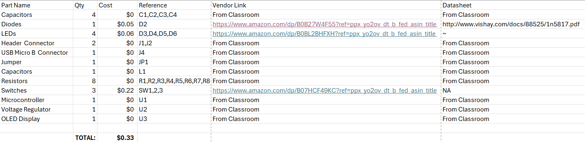

## Overview
This bill of materials defined the components used in the use of the Human Machine Interface. The BOM is meant to show all of the needed hardware and electronics to support the full functionality of the subsystem. The listed components are meant to fulfill these needs and requirments fully.

## Bill of Materials
{style width: "2000"}
**Figure 1:** Final Bill of Materials for the HMI.

## Resouce

The Bill of Material as a PDF download is available [*here*](egr314BOM.pdf), or as a xlsx download [*here*](egr314.xlsx)
