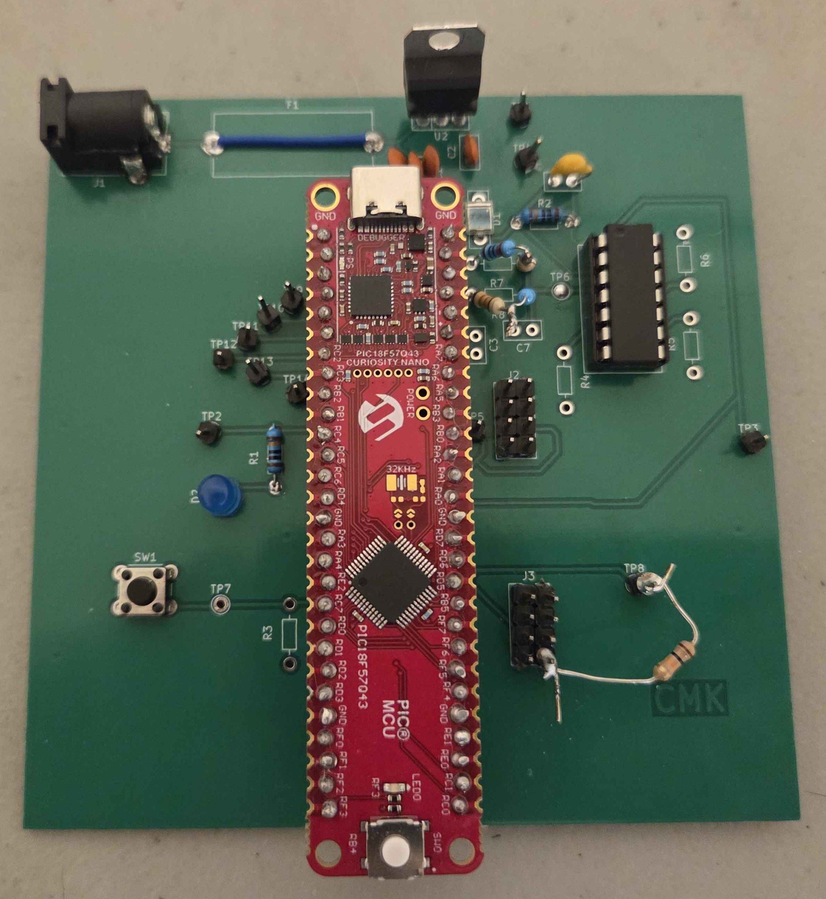
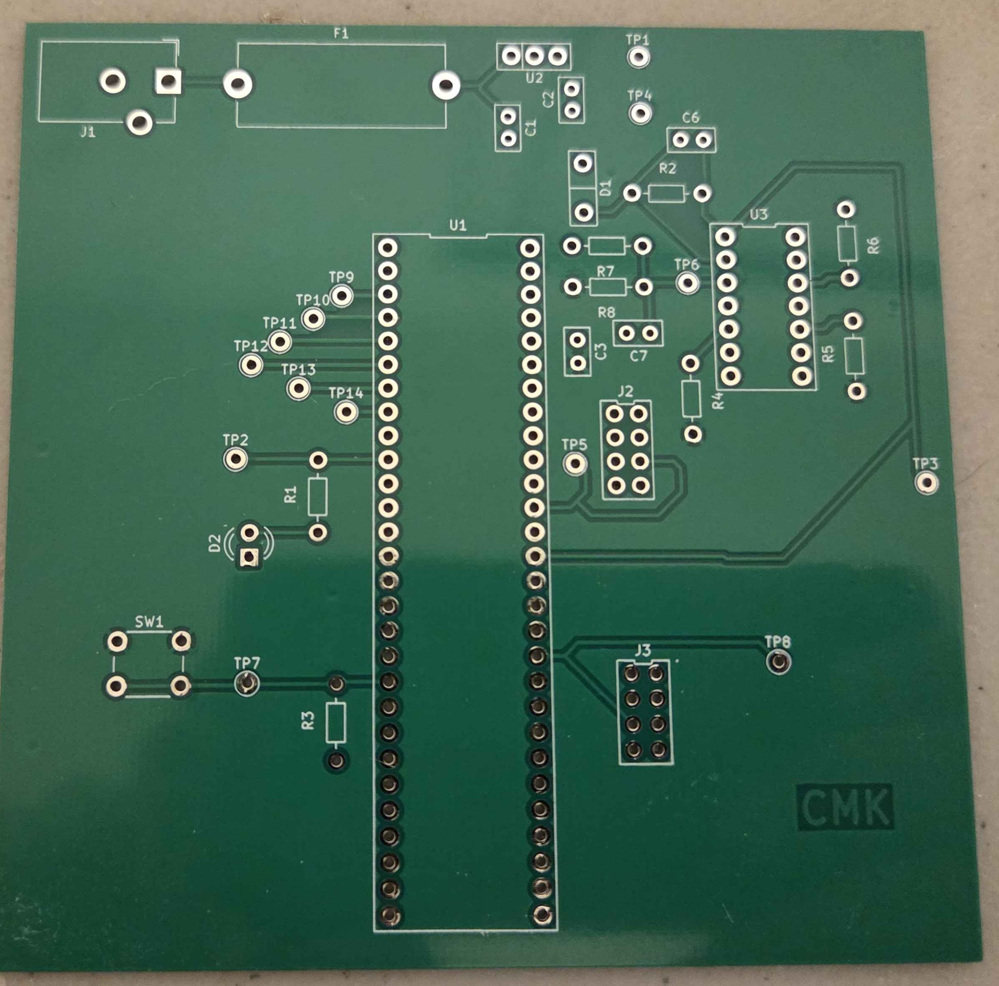
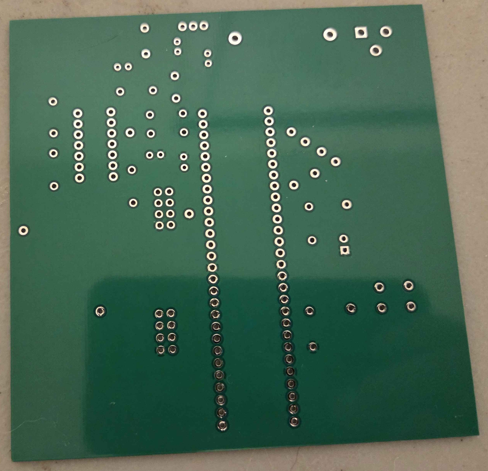

## PCB Pictures

{style width:"350" height:"300;"}
**Figure 1:** Completed Photodiode Subsystem PCB (*Front*)

{style width:"350" height:"300;"}
**Figure 2:** Unsoldered Photodiode Subsystem PCB (*Front*)

{style width:"350" height:"300;"}
**Figure 2:** Unsoldered Photodiode Subsystem PCB (*Back*)

## Kicad Pictures

{style width:"350" height:"300;"}
**Figure 3:** Kicad Photodiode Subsystem PCB (*Front*)

{style width:"350" height:"300;"}
**Figure 4:** Kicad Photodiode Subsystem PCB (*Back*)

## Resouces

The 3D views as PDF downloads are available here: [*front*](PCB_kicad_Front.pdf) | [*back*](PCB_kicad_Back.pdf)

The kicad project files (Including Gerber files) are available [*here*](EGR304_final_project_kicad.zip)