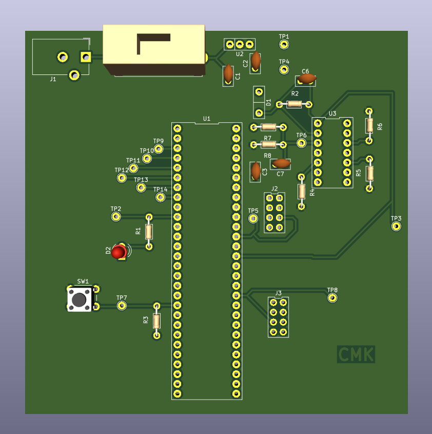
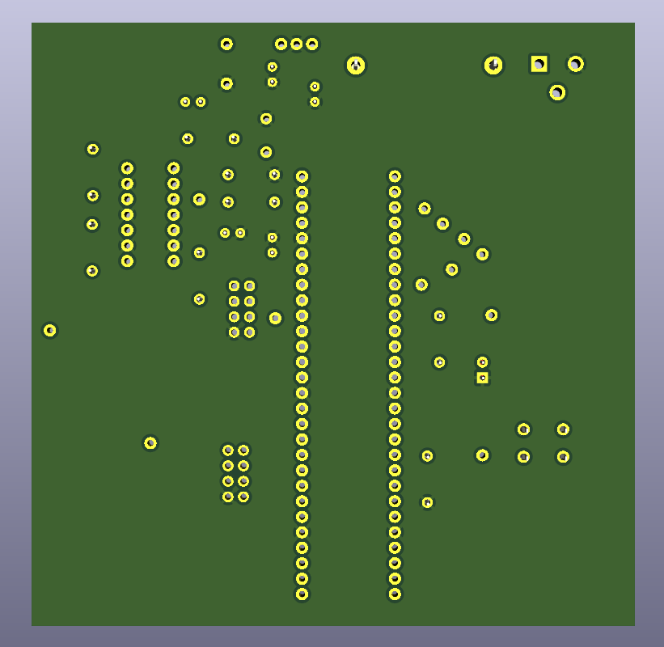

## PCB Pictures

{style width:"350" height:"300;"}
**Figure 1:** Photodiode Subsystem PCB (*Front*)

{style width:"350" height:"300;"}
**Figure 2:** Photodiode Subsystem PCB (*Front*)

## Kicad Pictures

{style width:"350" height:"300;"}
**Figure 3:** Kicad Photodiode Subsystem PCB (*Front*)

{style width:"350" height:"300;"}
**Figure 4:** Kicad Photodiode Subsystem PCB (*Back*)

## Resouces

The schematic as a PDF download is available here: [*front*](PCB_kicad_Front.pdf) | [*back*](PCB_kicad_Back.pdf)

The kicad project files are available [*here*](EGR304_final_project_kicad.zip)