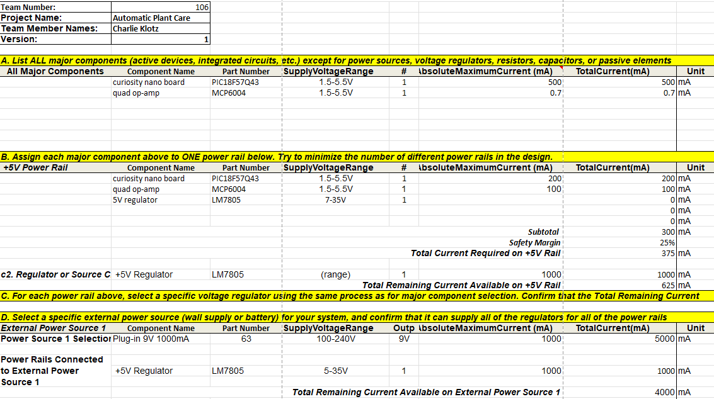

## Overview
This power budget is intended to confirm that the subsystems 9V input from a wall adapter will be enough to power each and every component safely. This step is crucial to ensuring reliability aswell as ensuring enough headroom for safety.

## Conclusions

From the Power Budget, we have confirmed that there is plenty of room left in terms of amperage available to power every component safely, with plenty of left over power to provide to any additional components added later on. 

## Resouces

The power budget as a PDF download is available [*here*](power-budget.pdf), and a Microsoft Excel Sheet [*here*](power-budget.xlsx).