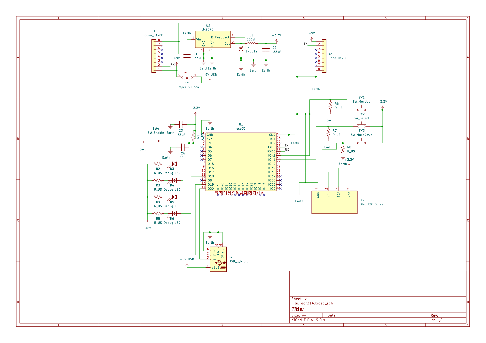

## Overview

This schematic is designed to support the Human Machine  subsystem through the use of an OLED screen, and three input buttons. This uses an ESP32 microcontroller, powered through a 3.3V switching regulator which is in turn powered through a 5V USB connection to a computer.

{style width:"350" height:"300;"}
**Figure 1:** Showing the final schematic for the Human Machine Interface.

## Resouces

The schematic as a PDF download is available [*here*](egr314.pdf), and the Zip folder of the project [*here*](egr314.zip).