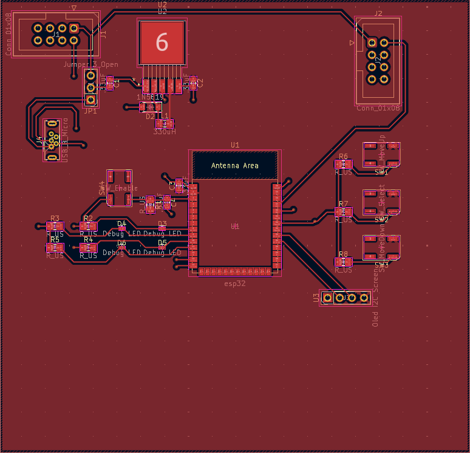
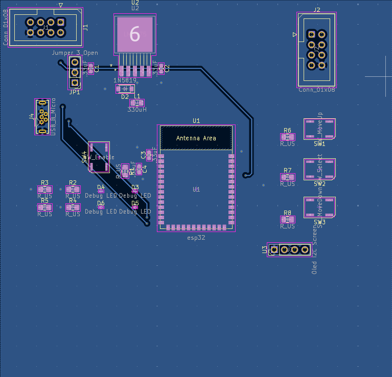
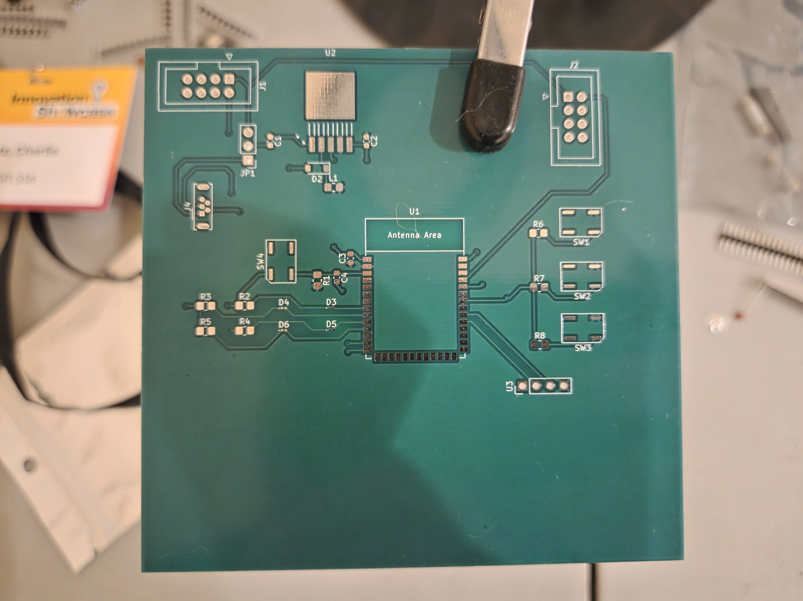
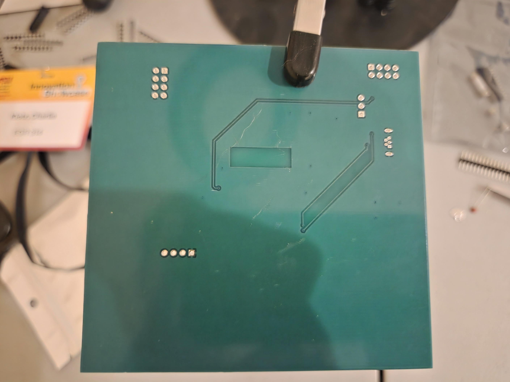
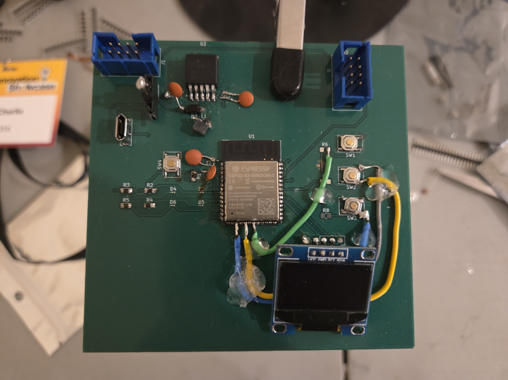
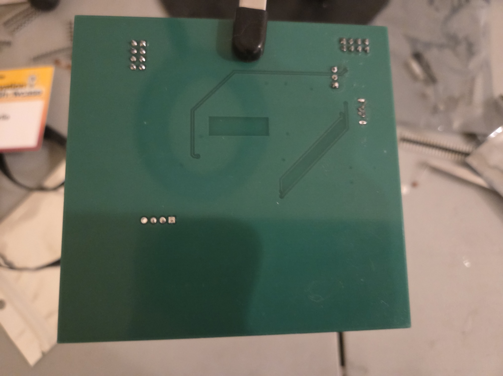

## Overview
The following is the final design for the PCB used in the HMI.

# ECAD

**Figure 1:** ECAD Front Copper

**Figure 2:** ECAD Back Copper

# Unpopulated Board

**Figure 1:** Unpopulated Board Front Copper

**Figure 2:** Unpopulated Board Back Copper

# Populated Board

**Figure 1:** Populated Board Front Side

**Figure 2:** Populated Board Back Side

## Resouces

The PCB as a Zip download of the project is available [*here*](egr314.zip).