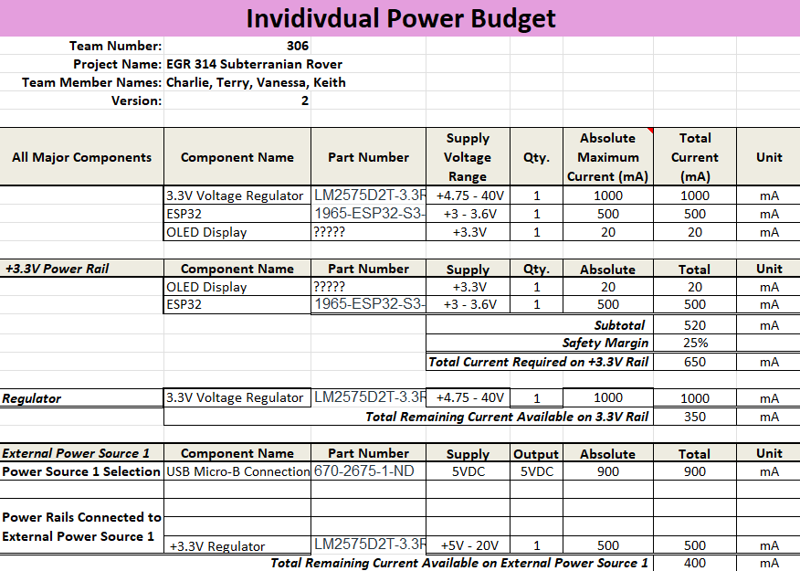

## Overview
This power budget is to verify that the 3.3V regulator will be able to supply the continous current needed for normal operations of the subsystem. 

To do this, we calculate an estimate for each components normal current draw, and add them all up to find a theoretical max current. By ensuring that this 'max current' falls within a threshold of the 1A max output of the regulator, we can be sure that the system will have a consistant and strong power supply.

{style width:"350" height:"300;"}

## Conclusions

From the Power Budget, it is clear that the 3.3V switching regulator will be more than enough to provide sufficient power to the subsystem. 

To find that out, I found each components max current information from its datasheet. The provided template then provided the calculations to confirm whether or not the design would be good with a 25% safety margin factored in. The final result made it clear that there should be no issues during normal operation.

## Resouces

The power budget as a PDF download is available [*here*](PowerBudget.pdf), and a Microsoft Excel Sheet [*here*](PowerBudget.xlsx).